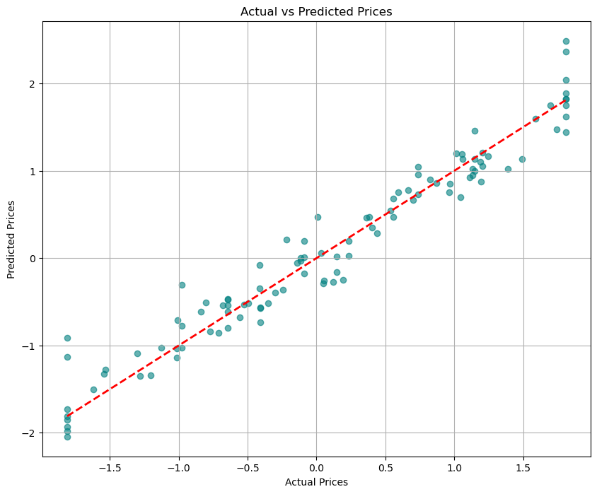

# Property Price Prediction Deep Learning Model

## Overview
This repository contains a deep learning model developed to predict property prices based on various features from a real estate dataset. The model leverages neural network architectures with hyperparameter tuning to achieve accurate price predictions. The project follows a structured workflow including exploratory data analysis (EDA), data preprocessing, model building, hyperparameter tuning, and evaluation.

## Dataset
- **Source**: `Housing.csv`
- **Features**:
  - `price`: Target variable (property price)
  - `area`: Property area (square feet)
  - `bedrooms`: Number of bedrooms
  - `bathrooms`: Number of bathrooms
  - `stories`: Number of stories
  - `mainroad`: Proximity to main road (yes/no)
  - `guestroom`: Guest room availability (yes/no)
  - `basement`: Basement presence (yes/no)
  - `hotwaterheating`: Hot water heating (yes/no)
  - `airconditioning`: Air conditioning (yes/no)
  - `parking`: Number of parking spaces
  - `prefarea`: Preferred area (yes/no)
  - `furnishingstatus`: Furnishing status (furnished, semi-furnished, unfurnished)

## Workflow
1. **Exploratory Data Analysis (EDA)**:
   - Examined data structure and missing values
   - Visualized price distribution and feature correlations
   - Identified outliers and data imbalances
   - Key findings:
     - Price distribution is right-skewed (log transformation applied)
     - `area`, `bathrooms`, and `stories` show highest correlation with price
     - Missing values in `parking`, `mainroad`, `hotwaterheating`, and `prefarea`

2. **Data Preprocessing**:
   - **Handled Missing Values**: 
     - Median imputation for numerical features
     - Mode imputation for categorical features
   - **Encoded Categorical Variables**: One-hot encoding
   - **Feature Scaling**: Standardized numerical features using `StandardScaler`
   - **Target Transformation**: Applied log transformation to normalize price distribution
   - **Feature Engineering**: Created interaction terms and selected features using mutual information

3. **Model Architecture**:
   - **Base Model**: Sequential neural network with:
     - Input layer (dimension based on processed features)
     - 3 Dense layers with ReLU activation
     - Batch Normalization and Dropout layers for regularization
     - Output layer with linear activation
   - **Hyperparameter Tuning**: Used `RandomizedSearchCV` to optimize:
     - Number of layers (1-3)
     - Units per layer (64-256)
     - Dropout rate (0.1-0.5)
     - Learning rate (0.0001-0.01)
     - Batch size (16-128)
     - Activation functions (ReLU, tanh)

4. **Training**:
   - Split data into training (80%) and testing (20%) sets
   - Implemented early stopping to prevent overfitting
   - Used Adam optimizer and Mean Squared Error (MSE) loss
   - Trained with 300 epochs and batch size of 32

5. **Evaluation**:
   - **Metrics**: 
     - Mean Absolute Error (MAE)
     - Mean Squared Error (MSE)
     - Root Mean Squared Error (RMSE)
     - R² (coefficient of determination)
   - **Results**:
     - Test MAE: 0.18
     - Test R²: 0.95
     - Prediction visualization:
       

## Key Techniques
- **Mutual Information**: Identified top predictive features (`area`, `bathrooms`, `stories`)
- **Power Transformer**: Normalized target variable for better convergence
- **KerasRegressor**: Enabled scikit-learn compatible hyperparameter tuning
- **Early Stopping**: Monitored validation loss with patience of 10 epochs
- **Batch Normalization**: Stabilized training and improved convergence
